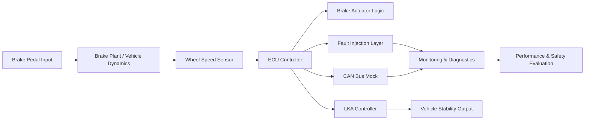

# MATLAB/Simulink-Inspired System Architecture

## Block Interpretation

- Brake Pedal Input: driver force or pedal travel signal
- Brake Plant / Vehicle Dynamics: pressure generation and deceleration behavior
- Wheel Speed Sensor: feedback for vehicle speed and stability estimation
- ECU Controller: core decision-making and brake supervision logic
- Fault Injection Layer: sensor offset, pressure loss, actuator failure, communication delay
- LKA Controller: prototype lane-keep assist logic
- CAN Bus Mock: simplified communication interface for ECU message handling
- Monitoring & Diagnostics: latency, pressure, speed, and fault status tracking

This structure is aligned with a MATLAB/Simulink-style control architecture commonly used in automotive embedded systems and HIL validation workflows.
